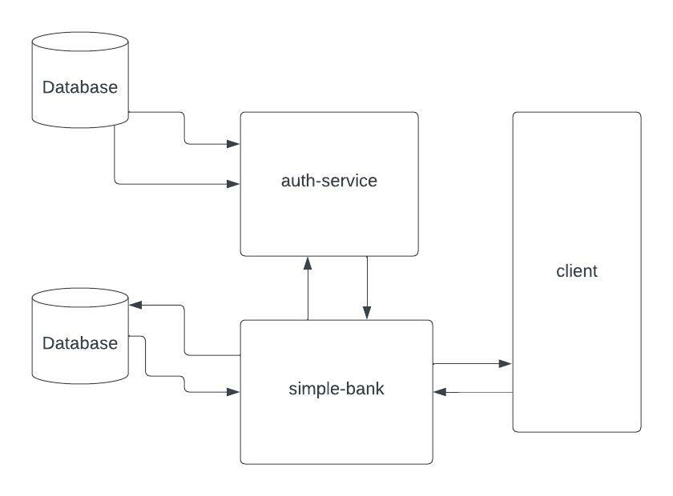
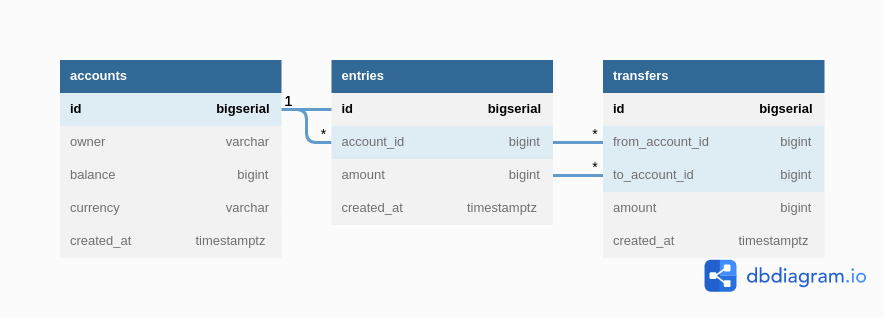

### 🏦 Educational project- simplebank🏦

## Currently made:
- Database schema design. 
- Generated CRUD queries using SQLC.
- Implemented balance transfer transaction.
- TX lock handled.
- Unit and integration tests.
- Github actions CI
- REST api. 
- Authorization and authentification with https://github.com/srjchsv/service  microservice.

## To run use `make docker`
it would run simple-bank and auth-service and make migrations.

### Accounts management:
    - POST signup `make signup`
    - POST signin `make signin`
    - GET get account by id `make get-account`
    - PUT Update account by id  `make update-account`
    - GET get accounts in batches `make get-accounts`
    - DELETE delete account by id `make delete-account`

### Balance transfers management:
    - POST Transfer balance from-to account `make transfer`

### Below is the postgres database schema:

### Useful links:
-  videos:
https://www.youtube.com/watch?v=rx6CPDK_5mU&list=PLy_6D98if3ULEtXtNSY_2qN21VCKgoQAE

- articles:
https://dev.to/techschoolguru/series/7172